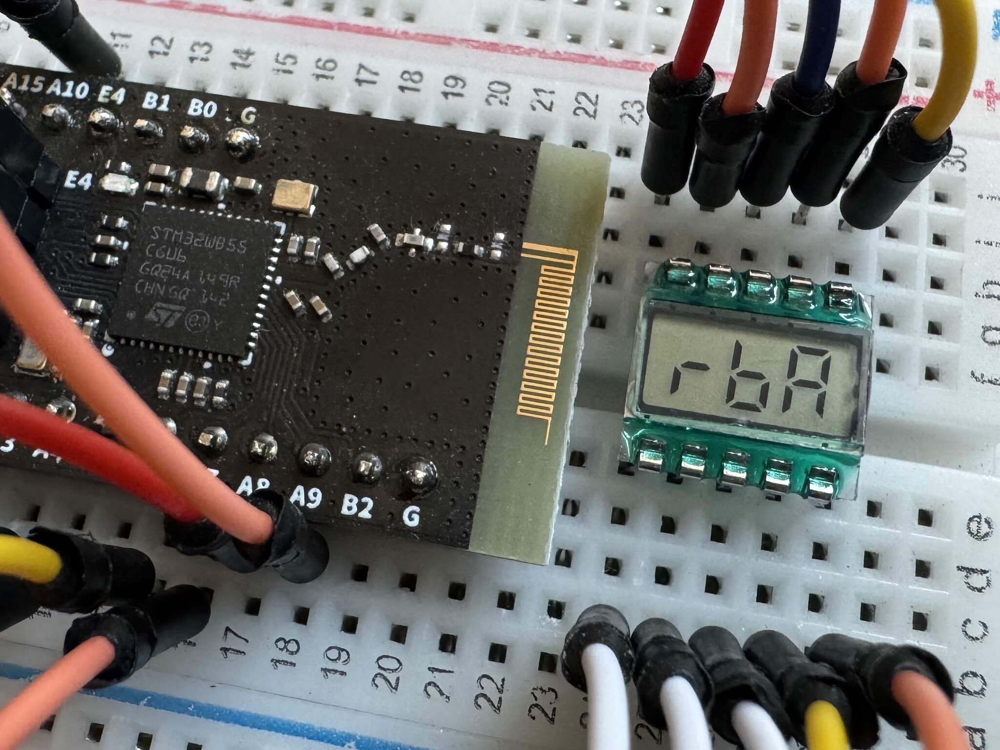

Experiment with [`embassy-rs`](https://github.com/embassy-rs/embassy), [`STM32WB55CGUx`](https://www.st.com/en/microcontrollers-microprocessors/stm32wb55cg.html) and the [tiny 3-digit 7-segment LCD display](aliexpress.com/item/1005005192561274.html).

Debugging is set up for VSCode as per [`probe-rs` docs](https://probe.rs/docs/tools/debugger/).